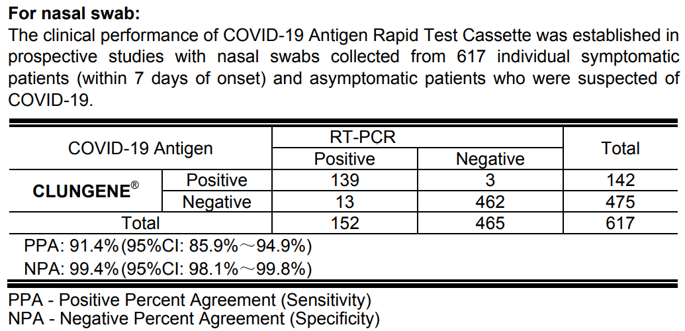
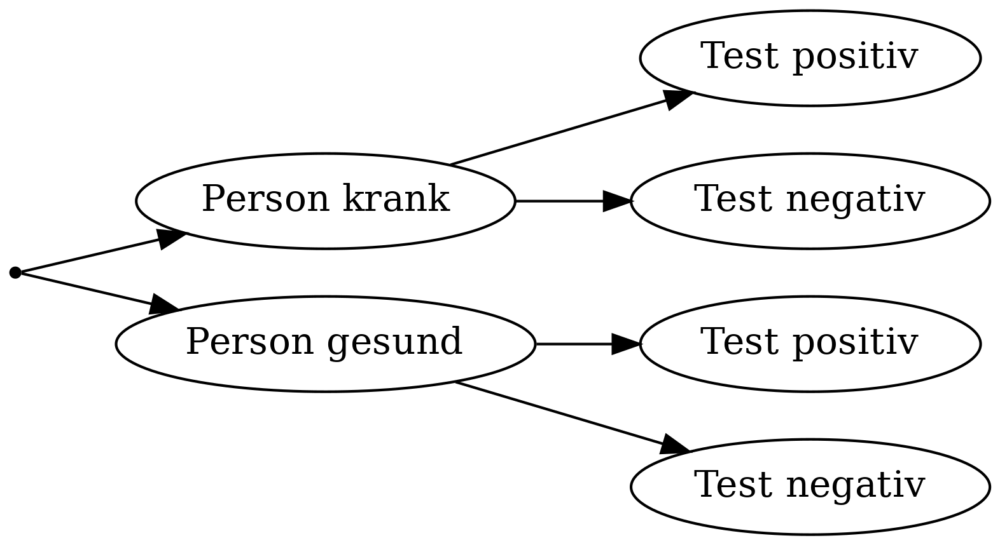
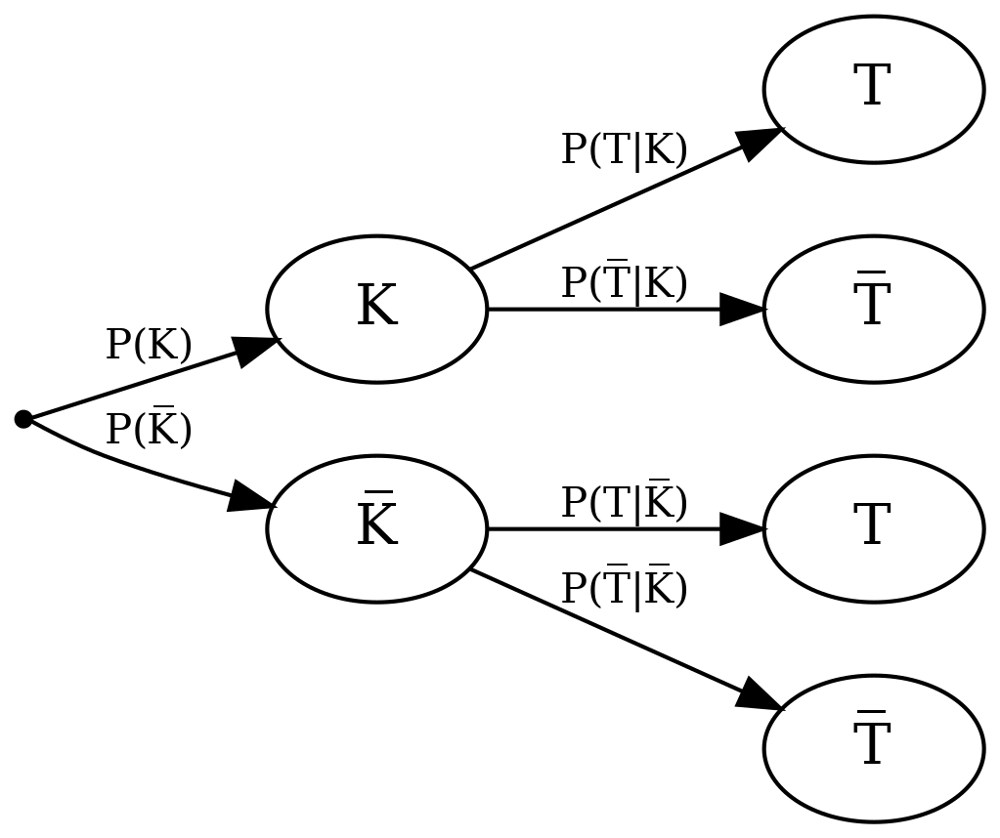
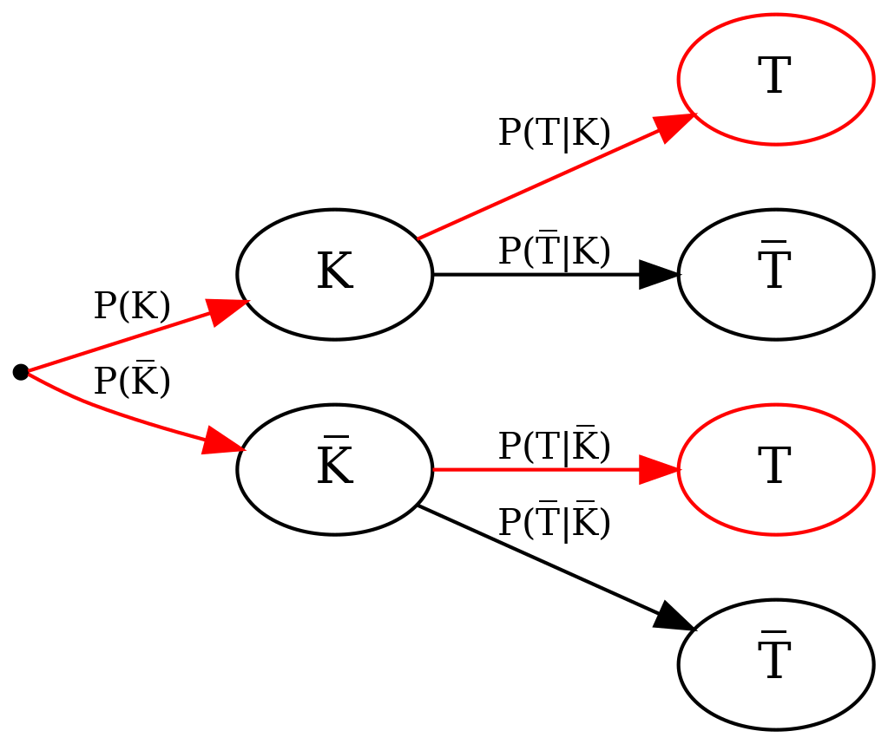

```{r setup, include=FALSE}
require(RAppArmor)     # auf Server notwendig für abgesicherte Codeausführung in Übungen
library(learnr)        # für Quizze, Code-Übungen, etc.
library(gradethis)     # für Evaluierung von Code-Einsendungen
library(shiny)         # für interaktive Elemente
library(ggplot2)       # für Grafiken

# folgendes ist notwendig um aktualisierte System-seitig installierte Version von pandoc zu verwenden, anstatt die in
# Shiny-Server / RStudio integrierte Variante:
rmarkdown::find_pandoc(cache = FALSE)

knitr::opts_chunk$set(echo = FALSE)

# Quizaufgaben sind momentan noch nicht richtig internationalisiert bei learnr;
# Wir überschreiben die englischsprachigen Nachrichten:
correct_msg <- "Richtig!"
incorrect_msg <- "Leider falsch. Versuch's noch einmal."

# Das gleiche gilt für gradethis:
options("gradethis.pass" = correct_msg)
options("gradethis.fail" = incorrect_msg)   # damit werden Codevorschläge bei falscher Antwort deaktiviert
gradethis_setup()

# Werte für das Beispiel
prevalence <- 0.2 / 100.0   # P(K)
sens <- 0.914   # P(T|K)
spec <- 0.994   # P(~T|~K)
pos_pred_val <- sens * prevalence / (sens * prevalence + (1-spec) * (1-prevalence))   # P(K|T)
```

## Fragestellung

Eine Person fühlt sich gerade krank und macht einen Corona-Schnelltest. Leider fällt der Test positiv aus.

{height=300px}    

Der Test ist zwar positiv, aber wie sicher kann sich die Person sein, dass sie wirklich an Corona erkrankt ist, d.h. wie sicher kann sie sich sein, dass das Testergebnis korrekt ist? Die gleiche Frage könnte man sich auch stellen, wenn der Test negativ wäre: Wie sicher ist es in diesem Fall, dass die Person wirklich *nicht* an Corona erkrankt ist?

::: summary

#### Fragestellung

Wie hoch ist die Wahrscheinlichkeit, dass ein Mensch mit positivem Corona-Test *wirklich* erkrankt ist? Wie hoch ist die Wahrscheinlichkeit, dass ein Mensch mit negativem Corona-Test *wirklich* gesund ist?  

:::

Als erstes sehen wir uns den Beipackzettel des Schnelltests in der Hoffnung an, dass wir dort Antworten auf unsere Fragen finden. 

{height=350px}

::: summary

#### Konfusionsmatrix des Schnelltests

|                 | **Person krank** | **Person gesund** | Gesamt |
|-----:|:----:|:----:|:----:|
|  Test positiv   |   139            |  3                | 142    |
|  Test negativ   |   13             |  462              | 475    |
|  Gesamt         |   152            |  465              | 617    |

:::

Versuchen wir, die Informationen zu entschlüsseln. Offenbar wurde eine Studie durchgeführt, in der Personen Proben entnommen wurden. Diese wurden einem RT-PCR-Test und einem Schnelltest der Marke CLUNGENE per Nasenabstrich (nasal swab) unterzogen und für jede Person wurden die Ergebnisse der beiden Tests miteinander verglichen. 

```{r clinicalstudy1}
question_numeric("Wie viele Personen haben an der Studie teilgenommen?",
  answer(617, correct = TRUE),
  allow_retry = TRUE,
  correct = correct_msg,
  incorrect = incorrect_msg
)
```

In dieser Studie sind wir nur an der Genauigkeit des Schnelltests interessiert. Dazu nehmen wir an, dass das Ergebnis des RT-PCR-Tests exakt ist und wir damit wissen, ob eine Person an Covid-19 erkrankt ist oder nicht. Wir überprüfen dann, ob der Schnelltest den Krankheitszustand der Personen richtig erkennt oder nicht. Statt Schnelltest schreiben wir ab hier nur kurz *Test*.

Werten wir das Ergebnis eines solchen Tests aus, können wir zunächst feststellen, dass wir es mit vier Möglichkeiten zu tun haben:

- Die Person ist krank und der Test ist positiv.
- Die Person ist krank und der Test ist negativ.
- Die Person ist gesund und der Test ist positiv.
- Die Person ist gesund und der Test ist negativ.

Man kann das übersichtlich als Tabelle darstellen:

|  | **Person krank** | **Person gesund** |
|-----:|:----:|:----:|
|  Test positiv   |   richtig positiv   |  falsch positiv    |
|  Test negativ   |   falsch negativ   |  richtig negativ   |

Diese Tabellendarstellung wird *Wahrheitsmatrix* oder auch *Konfusionsmatrix* genannt.

```{r clinicalstudy2}
question_numeric("Bei wie vielen Personen in der Studie hat der Test den Krankheitszustand richtig erkannt?",
  answer(601, correct = TRUE),
  allow_retry = TRUE,
  correct = correct_msg,
  incorrect = incorrect_msg
)
```

Unter der Konfusionsmatrix im Beipackzettel finden wir noch zwei Prozentangaben: *PPA* und *NPA*. Diese wurden aus den Werten in der Tabelle berechnet und sind Gütemaße für medizinische Tests:

**PPA** bedeutet *Positive Percent Agreement* oder auch *Richtig-Positiv-Rate*, bzw. *Sensitivität (Sensitivity).* Der Wert gibt an, wie viele Prozent von nachweislich positiven Covid-Fällen vom Test richtig als positiv erkannt werden. Bei unserem Test sind es im Mittel 91.4%.

**NPA** bedeutet *Negative Percent Agreement* oder auch *Richtig-Negativ-Rate*, bzw. *Spezifität (Specificity).* Der Wert gibt an, wie viele Prozent von nachweislich negativen Covid-Fällen vom Test richtig als negativ erkannt werden. Bei unserem Test sind es im Mittel 99.4%.

```{r calc_sens}
question_text("Wie wurde die Richtig-Positiv-Rate, bzw. Sensitivität von 91.4% aus der Konfusionsmatrix im Beipackzettel berechnet?",
  answer_fn(function (input) {
      mark_as(gsub("\\s+", "", input) == "139/152*100")   # Leerzeichen im Text ignorieren
  }),
  allow_retry = TRUE,
  trim = TRUE,
  placeholder = 'Geben Sie eine Prozentrechnung der Form "a/b*100" ein.',
  correct = correct_msg,
  incorrect = incorrect_msg
)
```


```{r calc_spec}
question_text("Wie wird die Richtig-Negativ-Rate, bzw. Spezifität von 99.4% aus der Konfusionsmatrix im Beipackzettel berechnet?",
  answer_fn(function (input) {
      mark_as(gsub("\\s+", "", input) == "462/465*100")   # Leerzeichen im Text ignorieren
  }),
  allow_retry = TRUE,
  trim = TRUE,
  placeholder = 'Geben Sie eine Prozentrechnung der Form "a/b*100" ein.',
  correct = correct_msg,
  incorrect = incorrect_msg
)
```


```{r confmat}
question("Nehmen wir an, ein Computersystem kann anhand eines Röntgenbildes erkennen, ob ein Knochen beschädigt ist. Dabei kann es drei verschiedene Zustände erkennen: Keine Beschädigung, Prellung, Knochenbruch. Lässt sich auch für ein solches System eine Konfusionsmatrix erstellen? Wenn ja, wie viele Zeilen und Spalten hätte diese Matrix?",
  answer("2 Zeilen und 2 Spalten."),
  answer("2 Zeilen und 3 Spalten."),
  answer("3 Zeilen und 2 Spalten."),
  answer("3 Zeilen und 3 Spalten.", correct = TRUE),
  answer("Es ist nicht möglich, eine Konfusionsmatrix für ein solches Computersystem zu erstellen."),
  allow_retry = TRUE,
  correct = correct_msg,
  incorrect = incorrect_msg
)
```

Warum beantworten Testgenauigkeit, Sensitivität und Spezifität nicht unsere eigentliche Fragestellung, die wir in der Zusammenfassung rechts oben sehen? Das werden wir uns auf der folgenden Seite anschauen.

## Analyse

Zur Formalisierung des Problems stellen wir das Vorgehen in der Studie als Baumdiagramm dar, was uns später bei der Beantwortung der eigentlich Fragestellung helfen wird. Wir wissen, wer gesund und wer krank ist und überprüfen für diese Gruppen von Personen jeweils, wie der Test ausfällt:


{height=200px}


Damit wir später gut rechnen können, definieren wir zunächst zwei Ereignisse und deren Negation. Diese entsprechen den oben genannten Möglichkeiten:

- $K$:Person krank
- $\overline K$: Person gesund
- $T$: Test positiv
- $\overline T$: Test negativ

::: summary

#### Definition der Ereignisse

- $K$:Person krank und $\overline K$: Person gesund
- $T$: Test positiv und $\overline T$: Test negativ

:::

Diese Ereignisse können wir in ein Baumdiagramm übertragen, zusammen mit den dazugehörigen Wahrscheinlichkeiten $P$:

{height=300px}

Wie in der Frage eingangs formuliert, möchten wir wissen, wie hoch die Wahrscheinlichkeit ist, dass eine Person tatsächlich krank ist, wenn der Test positiv ausfällt. Das lässt sich mithilfe der oben definierten Ereignisse als *bedingte Wahrscheinlichkeit* formulieren – die Wahrscheinlichkeit, dass eine Person krank ist, gegeben dass der Test positiv ist: $P(K \mid T)$. Diese Wahrscheinlichkeit wird auch *positiver Vorhersagewert* genannt, aber sie taucht im obigen Baumdiagramm nicht auf. Dort sind die Ereignisse K und T vertauscht wie in $P(T \mid K)$.

```{r P_T_K}
question("Was gibt die Wahrscheinlichkeit $P(T \\mid K)$ an?",
  answer("Die Wahrscheinlichkeit, dass ein Test positiv ist, wenn die getestete Person krank ist.", correct = TRUE),
  answer("Die Wahrscheinlichkeit, dass eine Person gesund ist, wenn sie einen positiven Test hatte."),
  answer("Die Wahrscheinlichkeit, dass eine Person krank ist, wenn sie einen positiven Test hatte."),
  answer("Die Wahrscheinlichkeit, dass ein Test positiv ist, obwohl die getestete Person gesund ist."),
  allow_retry = TRUE,
  correct = correct_msg,
  incorrect = incorrect_msg
)
```

$P(T \mid K)$ wird *Sensitivität* genannt und ist ein Gütemaß für einen Test, wie wir im Beipackzettel schon gesehen haben. Die Sensitivität gibt an, wie hoch die Wahrscheinlichkeit ist, dass der Test ein positives Ergebnis anzeigt für eine tatsächlich erkrankte Person und wird daher auch *Richtig-positiv-Rate* genannt. 

Um nun den eigentlich gesuchten *positiven Vorhersagewert*, also die bedingte Wahrscheinlichkeit $P(K \mid T)$ zu berechnen, können wir den **Satz von Bayes** benutzen:


$$
P(K \mid T) = \frac{P(T \mid K) P(K)}{P(T)}.
$$

Was wir also brauchen, um $P(K \mid T)$ zu berechnen, sind drei Wahrscheinlichkeiten: $P(K)$, $P(T \mid K)$ und $P(T)$.

::: summary

#### Definition der bedingten Wahrscheinlichkeiten

$P(K \mid T)$ – Wahrscheinlichkeit, dass eine Person tatsächlich krank ist, unter der Bedingung dass der Test positiv ist

#### Satz von Bayes

$$
P(K \mid T) = \frac{P(T \mid K) P(K)}{P(T)}.
$$

:::

$P(K)$ gibt an, wie hoch generell die Wahrscheinlichkeit ist, zu diesem Zeitpunkt an Corona erkrankt zu sein – ganz unabhängig von einem Testergebnis. Diesen Wert nennt man auch *Prävalenz.* Genau können wir diese Wahrscheinlichkeit niemals wissen, aber wir können einen Schätzwert nehmen, der dem Anteil der aktuell an Corona infizierten Menschen in Deutschland entspricht. Setzen wir zunächst $P(K) = `r prevalence * 100`\%$. Das ist in etwa die Prävalenz bei der ersten Coronawelle im Frühjahr 2020 in Deutschland.

Man könnte auch auf die Idee kommen, $P(K)$ aus der Studie im Beipackzettel abzulesen, doch das ist in den meisten Fällen nicht sinnvoll: die Studie, die zu den Ergebnissen im Beipackzettel geführt hat, untersucht ja gerade wie gut der Test bei kranken Personen funktioniert, daher wurden gezielt Menschen mit nachweislicher Covid-Infektion getestet, so dass hier nicht von einem Querschnitt der Bevölkerung gesprochen werden kann.

::: summary

#### Definition der bedingten Wahrscheinlichkeiten

$P(T \mid K)$ – Wahrscheinlichkeit, dass ein Test ein positives Ergebnis anzeigt, unter der Bedingung dass die Person tatsächlich erkrankt ist (Sensitivität)

:::

Die Wahrscheinlichkeit $P(T \mid K)$ ist im Beipackzettel als Sensitivität schon angegeben. 

Schließlich fehlt noch $P(T)$: die Wahrscheinlichkeit dafür, dass eine Person – egal ob krank oder gesund – bei einem Test ein positives Ergebnis erhält. Hier hilft uns das *Gesetz der totalen Wahrscheinlichkeit*, das es uns erlaubt, die Wahrscheinlichkeiten für die beiden Möglichkeiten, die zu positiven Tests führen (Person krank und Person gesund), zu addieren, da sie sich gegenseitig ausschließen:

{height=300px}

Somit erhalten wir

$$
P(T) = P(T \mid K) P(K) + P(T \mid \overline K) P(\overline K),
$$

und damit

$$
P(K \mid T) = \frac{P(T \mid K) P(K)}{P(T)} = \frac{P(T \mid K) P(K)}{P(T \mid K) P(K) + P(T \mid \overline K) P(\overline K)}.
$$

Das bringt uns allerdings zwei neue Probleme ein: Wir brauchen $P(T \mid \overline K)$ und $P(\overline K)$. Beides können wir zum Glück über die Wahrscheinlichkeit für komplementäre Ereignisse berechnen. Damit ist $P(\overline K)$ (die generelle Wahrscheinlichkeit *nicht* krank zu sein) leicht zu errechnen, denn $P(K)$ (die generelle Wahrscheinlichkeit krank zu sein, geschätzt mittels Prävalenz) kennen wir schon: $P(\overline K) = 100\% - P(K) = `r (1 - prevalence)*100`\%$.

Fehlt zu guter letzt noch $P(T \mid \overline K)$: Die Wahrscheinlichkeit ein positives Testergebnis zu haben, wenn man eigentlich gesund ist (ein *falsch-positives Ergebnis*). Hier hilft uns ein weiteres Gütemaß für Tests weiter: die *Spezifität*, auch *Richtig-negativ Rate* genannt. Sie gibt uns die Wahrscheinlichkeit an, dass eine Person ein negatives Testergebnis erhält, wenn sie tatsächlich gesund ist, also $P(\overline T | \overline K)$. Auch die Spezifität wird oft im Beipackzettel von Schnelltests abgedruckt, wie wir schon gesehen haben. Wie wir im Baumdiagramm erkennen, ist $P(\overline T | \overline K)$ komplementär zu $P(T | \overline K)$ und damit gilt $P(T | \overline K) = 100\% - P(\overline T | \overline K)$.

::: summary


#### Satz von Bayes {.replace}

\begin{align}
P(K \mid T) &= \frac{P(T \mid K) P(K)}{P(T)} \\
            &= \frac{P(T \mid K) P(K)}{P(T \mid K) P(K) + P(T \mid \overline K) P(\overline K)}.
\end{align}

#### Definition der bedingten Wahrscheinlichkeiten

$P(\overline T \mid \overline K)$ – Wahrscheinlichkeit, dass ein Test ein negatives Ergebnis anzeigt, unter der Bedingung dass die Person tatsächlich gesund ist (Spezifität)

:::

### Berechnung

Um beispielhaft zu berechnen, wie hoch die Wahrscheinlichkeit ist, dass eine Person tatsächlich krank ist, wenn sie ein positives Testergebnis von unserem betrachteten Schnelltest erhält, notieren wir noch mal die Sensitivität und Spezifität aus dem Beipackzettel:

- Sensitivität: $P(T \mid K) = `r sens * 100`\%$
- Spezifität: $P(\overline T \mid \overline K) = `r spec * 100`\%$

Für die Prävalenz hatten wir $P(K) = `r prevalence * 100`\%$ angenommen.

Damit können wir die Werte in die Formel einsetzen und erhalten:

\begin{align}
P(K \mid T) &= \frac{P(T \mid K) P(K)}{P(T \mid K) P(K) + P(T \mid \overline K) P(\overline K)} \\[10pt]
            &= \frac{P(T \mid K) P(K)}{P(T \mid K) P(K) + (1 - P(\overline T \mid \overline K)) (1 - P(K))} \\[10pt]
            &= \frac{`r sens` \cdot `r prevalence`}{`r sens` \cdot `r prevalence` + (1 - `r spec`) \cdot (1 - `r prevalence`)} \\[10pt]
            &= `r round(pos_pred_val, 4)`.
\end{align}

### Interpretation

Die Wahrscheinlichkeit, dass eine Person mit positivem Schnelltest tatsächlich krank ist (positiver Vorhersagewert), beträgt also nur rund $`r round(pos_pred_val * 100)`\%$. Das ist tatsächlich keine sonderlich hohe Wahrscheinlichkeit und auf den ersten Blick verwunderlich, denn sowohl Sensitivität als auch Spezifität liegen als Gütemaße im Beipackzettel des Tests nahe 100%. Auf der folgenden Seite werden wir uns genauer anschauen, warum das so ist.

### Quizaufgaben

```{r P_K}
question_text(
  "Nehmen wir an, die Studie mit der der Schnelltest evaluiert wurde, spiegelt die wirkliche Krankheitsrate
in der Bevölkerung (d.h. die Prävalenz) wider. Berechnen Sie diese Prävalenz $P(K)$ aus den Daten in der 
Konfusionsmatrix<span class=\"survey_zusammenfassung\">, abgebildet in der Zusammenfassung auf der rechten
Seite</span>.

Geben Sie entweder einen mathematischen Ausdruck wie `(20+11)/10` ein oder eine Zahl wie `3.1`
(Achtung, das Dezimalzeichen ist der Punkt).",
  answer_fn(function(input) {
    expected_result <- 152/617
    allowed_chars <- "0123456789\\.\\+\\*/\\(\\)-^"
    allowed_max_length <- 128

    if (nchar(input) > allowed_max_length) {
        return(learnr::incorrect("Deine Eingabe ist leider zu lang."))
    }

    if (grepl(paste0("[^ ", allowed_chars, "]"), input)) {
        return(learnr::incorrect(paste("Deine Eingabe enthält ungültige Zeichen. Nur folgende Zeichen sind möglich:",
                                    gsub("\\", "", allowed_chars, fixed = TRUE))))
    }

    result <- eval(parse(text = input), envir = new.env())
    
    if (identical(round(result, 4), round(expected_result, 4))) {
        correct(sprintf("Das Ergebnis ist %.2f.", result))
    } else {
        incorrect(NULL)
    }
  }),
  allow_retry = TRUE,
  trim = TRUE,
  placeholder = 'Mathematischer Ausdruck bzw. Zahl',
  correct = correct_msg,
  incorrect = incorrect_msg
)
```

```{r P_T}
question_text(
  "Berechnen Sie die totale Wahrscheinlichkeit $P(T)$, dass ein Test positiv ausfällt, unabhängig vom
Krankheitszustand der getesteten Person. Nehmen Sie dieses mal eine Prävalenz von $P(K)=0.25$ an, aber nutzen
Sie die Werte von Sensitivität und Spezifität vom Beipackzettel, d.h. $P(T \\mid K) = 0.914$ und
$P(\\overline T \\mid \\overline K) = 0.994$.

Geben Sie entweder einen mathematischen Ausdruck wie `(20+11)/10` ein oder eine Zahl wie `3.1`
(Achtung, das Dezimalzeichen ist der Punkt).
",
  answer_fn(function(input) {
    expected_result <- 0.914*0.25+(1-0.994)*(1-0.25)
    allowed_chars <- "0123456789\\.\\+\\*/\\(\\)-^"
    allowed_max_length <- 128

    if (nchar(input) > allowed_max_length) {
        return(learnr::incorrect("Deine Eingabe ist leider zu lang."))
    }

    if (grepl(paste0("[^ ", allowed_chars, "]"), input)) {
        return(learnr::incorrect(paste("Deine Eingabe enthält ungültige Zeichen. Nur folgende Zeichen sind möglich:",
                                    gsub("\\", "", allowed_chars, fixed = TRUE))))
    }

    result <- eval(parse(text = input), envir = new.env())
    
    if (identical(round(result, 4), round(expected_result, 4))) {
        correct(sprintf("Das Ergebnis ist %.2f.", result))
    } else {
        incorrect(NULL)
    }
  }),
  allow_retry = TRUE,
  trim = TRUE,
  placeholder = 'Mathematischer Ausdruck bzw. Zahl',
  correct = correct_msg,
  incorrect = incorrect_msg
)
```


```{r P_K_T}
question_text(
  "Berechnen Sie die Wahrscheinlichkeit $P(K|T)$, dass eine positiv getestete Person tatsächlich krank ist.
Nehmen Sie dieses mal eine Prävalenz von $P(K)=0.25$ sowie eine totale Wahrscheinlichkeit für einen positiven Test
von $P(T)=0.233$ an, aber nutzen Sie die Werte von Sensitivität und Spezifität vom Beipackzettel, d.h.
$P(T \\mid K) = 0.914$ und $P(\\overline T \\mid \\overline K) = 0.994$. Vergleichen Sie das Ergebnis mit dem
Ergebnis, dass bei der Beispielrechnung mit einer Prävalenz von $P(K) = 0.2\\%$ erzeugt wurde.

Geben Sie entweder einen mathematischen Ausdruck wie `(20+11)/10` ein oder eine Zahl wie `3.1`
(Achtung, das Dezimalzeichen ist der Punkt).",
  answer_fn(function(input) {
    expected_result <- 0.914*0.25/0.233
    allowed_chars <- "0123456789\\.\\+\\*/\\(\\)-^"
    allowed_max_length <- 128

    if (nchar(input) > allowed_max_length) {
        return(learnr::incorrect("Deine Eingabe ist leider zu lang."))
    }

    if (grepl(paste0("[^ ", allowed_chars, "]"), input)) {
        return(learnr::incorrect(paste("Deine Eingabe enthält ungültige Zeichen. Nur folgende Zeichen sind möglich:",
                                    gsub("\\", "", allowed_chars, fixed = TRUE))))
    }

    result <- eval(parse(text = input), envir = new.env())
    
    if (identical(round(result, 4), round(expected_result, 4))) {
        correct(sprintf("Das Ergebnis ist %.2f.", result))
    } else {
        incorrect(NULL)
    }
  }),
  allow_retry = TRUE,
  trim = TRUE,
  placeholder = 'Mathematischer Ausdruck bzw. Zahl',
  correct = correct_msg,
  incorrect = incorrect_msg
)
```

```{r P_nK_nT_ausdruck}
question("Sie möchten die Wahrscheinlichkeit berechnen, dass eine Person, die einen negativen Schnelltest hat,
          tatsächlich gesund ist. Welche Wahrschlichkeit ist das, mathematisch ausgedrückt?",
  answer("$P(\\overline T \\mid \\overline K)$"),
  answer("$P(T \\mid \\overline K)$"),
  answer("$P(K \\mid \\overline T)$"),
  answer("$P(\\overline K \\mid \\overline T)$", correct = TRUE),
  answer("$P(\\overline K, \\overline T)$"),
  answer("$P(\\overline T, \\overline K)$"),
  allow_retry = TRUE,
  correct = correct_msg,
  incorrect = incorrect_msg
)
```

```{r P_nK_nT_berechnet}
question_text(
  "Sie möchten die Wahrscheinlichkeit berechnen, dass eine Person, die einen negativen Schnelltest hat, tatsächlich
gesund ist. Nehmen Sie eine Prävalenz von $P(K)=0.2\\%$ an. Für die Güte des Schnelltests nehmen Sie die Werte von
Sensitivität und Spezifität aus dem Beipackzettel, d.h. $P(T \\mid K) = 0.914$ und
$P(\\overline T \\mid \\overline K) = 0.994$.

Tipp: Versuchen Sie, den Satz von Bayes für die bedingte Wahrscheinlichkeit $P(\\overline K \\mid \\overline T)$
anzuwenden.

Geben Sie entweder einen mathematischen Ausdruck wie `(20+11)/10` ein oder eine Zahl wie `3.1`
(Achtung, das Dezimalzeichen ist der Punkt).",
  answer_fn(function(input) {
    expected_result <- 0.994 * (1-0.002) / (0.994 * (1-0.002) + (1-0.914) * 0.002)
    allowed_chars <- "0123456789\\.\\+\\*/\\(\\)-^"
    allowed_max_length <- 128

    if (nchar(input) > allowed_max_length) {
        return(learnr::incorrect("Deine Eingabe ist leider zu lang."))
    }

    if (grepl(paste0("[^ ", allowed_chars, "]"), input)) {
        return(learnr::incorrect(paste("Deine Eingabe enthält ungültige Zeichen. Nur folgende Zeichen sind möglich:",
                                    gsub("\\", "", allowed_chars, fixed = TRUE))))
    }

    result <- eval(parse(text = input), envir = new.env())
    
    if (identical(round(result, 4), round(expected_result, 4))) {
        correct(sprintf("Das Ergebnis ist %.6f.", result))
    } else {
        incorrect(NULL)
    }
  }),
  allow_retry = TRUE,
  trim = TRUE,
  placeholder = 'Mathematischer Ausdruck bzw. Zahl',
  correct = correct_msg,
  incorrect = incorrect_msg
)
```

---

#### Einführung Code-Aufgaben

In dieser Lernanwendung werden Ihnen auch Aufgaben gestellt, die Sie mittels R-Code lösen sollen. Dabei geht es um kurze Codeschnipsel, die Sie entweder ergänzen sollen (indem Sie Platzhalter durch entsprechenden Code ersetzen) oder die Sie komplett selbst schreiben sollen. In den meisten Fällen erzeugen Sie dabei ein abschließendes Ergebnis, **welches in der letzten Zeile stehen muss.**

**Beispielaufgabe:** Bestimmen Sie den Mittelwert der Augenzahlen eines sechsseitigen Würfels. Im Code haben wir schon die Augenzahlen 1 bis 6 in der Variable `wuerfel` vorgegeben. Benutzen Sie jetzt eine entsprechende R-Funktion, um den Mittelwert daraus zu bestimmen. Ersetzen Sie dafür den Platzhalter `___`.

```{r code_intro1, exercise=TRUE, exercise.timelimit=5, exercise.blanks = "___+"}
wuerfel <- 1:6
___(wuerfel)
```

```{r code_intro1-solution}
wuerfel <- 1:6
mean(wuerfel)
```

```{r code_intro1-check}
grade_this({
    wuerfel <- 1:6
    # Prüfen d. Ergebnisses
    if (.result == mean(wuerfel)) {
        pass()
    }
    fail()  # falls nicht korrekt
})
```

<div id="code_intro1-hint">
Mit der Funktion `mean()` lässt sich das arithmetische Mittel in R berechnen.
</div>

Wie Sie sehen, müssen Sie also das Endergebnis in die letzte Zeile der Code-Eingabe schreiben.


#### Aufgabe 1a

Im folgenden Code wird die Konfusionsmatrix `konfmat` mit den Werten aus dem Beipackzettel erzeugt.

Erweitern Sie den Code so, dass `konfmat` um die Randsummen erweitert wird. Nutzen Sie dafür die Funktion `addmargins`.

```{r konfmat_randsummen, exercise=TRUE, exercise.timelimit=5}
konfmat <- matrix(c(139, 13, 3, 462), ncol = 2)
colnames(konfmat) <- c("krank", "gesund")
rownames(konfmat) <- c("positiv", "negativ")
konfmat
```

```{r konfmat_randsummen-check}
grade_this({
    konfmat <- matrix(c(139, 13, 3, 462), ncol = 2)
    colnames(konfmat) <- c("krank", "gesund")
    rownames(konfmat) <- c("positiv", "negativ")
    konfmat2 <- addmargins(konfmat)
    
    # Prüfen d. Ergebnisses
    if (identical(.result, konfmat2)) {
        pass()
    }
    fail()  # falls nicht korrekt
})
```


#### Aufgabe 1b

Im folgenden Code wird die Konfusionsmatrix `konfmat` mit den Werten aus dem Beipackzettel erzeugt. Berechnen Sie
$P(T \mid K) = \frac{P(T, K)}{P(K)}$ direkt mittels `konfmat`. Sie können auf den Wert in Zeile `i` und Spalte `j`
zugreifen, indem Sie die Syntax `konfmat[i, j]` verwenden. Sie können die komplette Zeile `i` mittels
`konfmat[i,]` und die komplette Spalte `j` mittels `konfmat[,j]` auswählen.


```{r konfmat_r_P_T_K, exercise=TRUE, exercise.timelimit=5}
konfmat <- matrix(c(139, 13, 3, 462), ncol = 2)
colnames(konfmat) <- c("krank", "gesund")
rownames(konfmat) <- c("positiv", "negativ")
konfmat
```

```{r konfmat_r_P_T_K-solution}
konfmat <- matrix(c(139, 13, 3, 462), ncol = 2)
colnames(konfmat) <- c("krank", "gesund")
rownames(konfmat) <- c("positiv", "negativ")
konfmat[1, 1] / sum(konfmat[,1])
```

```{r konfmat_r_P_T_K-check}
grade_this({
    konfmat <- matrix(c(139, 13, 3, 462), ncol = 2)
    colnames(konfmat) <- c("krank", "gesund")
    rownames(konfmat) <- c("positiv", "negativ")
    
    # Prüfen d. Ergebnisses
    if (identical(.result, konfmat[1, 1] / sum(konfmat[,1]))) {
        pass()
    }
    fail()  # falls nicht korrekt
})
```

<div id="konfmat_r_P_T_K-hint">
Wählen Sie mittels `konfmat[i,j]` den entsprechenden Wert für $T \cap K$ (positiver Test *und* krank) aus `konfmat`
aus. Berechnen Sie außerdem die Anzahl der Menschen die nachweislich krank waren als Summe der "krank" Spalte. Das
können Sie mittels Auswahl der Spalte machen und der Funktion `sum()`. Anschließend können Sie die Anzahl für 
$T \cap K$ teilen durch die Anzahl für $K$.
</div>


## Der Einfluss von Prävalenz und Testgenauigkeit

Schauen wir uns noch mal die Berechnung der bedingten Wahrscheinlichkeit $P(K \mid T)$ an:

\begin{align}
P(K \mid T) &= \frac{P(T \mid K) P(K)}{P(T \mid K) P(K) + P(T \mid \overline K) P(\overline K)} \\[10pt]
            &= \frac{`r sens` \cdot `r prevalence`}{`r sens` \cdot `r prevalence` + `r 1-spec` \cdot `r 1-prevalence`} \\[10pt]
            &= `r round(pos_pred_val, 4)`.
\end{align}

Man sieht daran sehr gut, welch großen Einfluss die Prävalenz auf das Gesamtergebnis hat: Selbst bei hoher Sensitivität des Tests wird der Zähler $P(T \mid K) P(K)$ und damit das Gesamtergebnis sehr klein, wenn die Prävalenz sehr klein ist. Das macht auch intuitiv Sinn: Wenn es insgesamt sehr wenige Fälle einer Krankheit gibt, ist die Wahrscheinlichkeit vergleichsweise gering, dass eine Person ausgerechnet damit erkrankt ist, selbst wenn der Test positiv ausfällt. Dagegen ist die Wahrscheinlichkeit sehr hoch, dass eine Person an einer Krankheit erkrankt ist, bei der es gerade viele Krankheitsfälle gibt (die Prävalenz also sehr hoch ist) ganz unabhängig davon, wie gut der Test funktioniert.

Wir können das auch visualisieren, indem wir $P(K \mid T)$ in Abhängigkeit der Prävalenz darstellen für fest gewählte Sensitivität und Spezifität:

```{r}
calc_ppv <- function(prev, sens, spec) {
    sens * prev / (sens * prev + (1-spec) * (1-prev))
}

# Erstellung eines Dataframes mit der Kombination aller Parameter (kartesisches Produkt)
ppv_by_param <- expand.grid(prev = seq(0, 1, length.out = 1001),
                            sens = c(0.80, 0.914, 0.9999),
                            spec = seq(0.990, 0.999, length.out = 10))
# P(K|T) für jede Parameterkombination berechnen
ppv_by_param$ppv <- calc_ppv(ppv_by_param$prev, ppv_by_param$sens, ppv_by_param$spec)

# Darstellung P(K|T) für bestimmte Sensitivität und Spezifität in Abh. von Prävalenz
fixed_sens <- sens
fixed_spec <- spec

ppv_fixed_sens_spec <- ppv_by_param[ppv_by_param$sens == fixed_sens & ppv_by_param$spec == fixed_spec, ]

ggplot(ppv_fixed_sens_spec, aes(prev, ppv)) +
    geom_line() +
    # X-Achse in Prozent
    scale_x_continuous('Prävalenz', labels = scales::percent) +
    # Y-Achse in Prozent
    scale_y_continuous(expression("P" * (K ~ "|" ~ T )), labels = scales::percent) +
    labs(title = expression("Positiver Vorhersagewert P" * (K ~ "|" ~ T ) ~ "in Abhängigkeit der Prävalenz"),
         subtitle = sprintf("Bei Sensitivität von %.1f%% und Spezifität von %.1f%%.", fixed_sens * 100, fixed_spec * 100)) +
    theme_minimal()
```

Wir sehen, wie stark die Kurve ansteigt und schon bei einer Prävalenz von 10% können wir einem Testergebnis mit der gegebenen Sensitivität und Spezifität trauen. Für geringere Prävalenzen ist das weniger gerechtfertigt, wie hier noch mal im Detail dargestellt:


```{r, warning=FALSE}
# wie oben, nur mit Begrenzung der X-Achse
ggplot(ppv_fixed_sens_spec, aes(prev, ppv)) +
    geom_line() +
    scale_x_continuous('Prävalenz', labels = scales::percent, limits = c(0.001, 0.02)) +
    scale_y_continuous(expression("P" * (K ~ "|" ~ T )), labels = scales::percent) +
    labs(title = expression("Positiver Vorhersagewert P" * (K ~ "|" ~ T ) ~ "in Abhängigkeit der Prävalenz"),
         subtitle = sprintf("Bei Sensitivität von %.1f%% und Spezifität von %.1f%%.", fixed_sens * 100, fixed_spec * 100)) +
    theme_minimal()
```


Andererseits zeigt es auch, wie wichtig genaue Tests sind. Bei niedriger Prävalenz spielt hierbei besonders die Spezifität eine wichtige Rolle, wie folgende Grafiken zeigen:


```{r, warning=FALSE}
# Wie oben, aber mit verschiedenen Werten für die Spezifität als unterschiedlich gefärbte Linien und
# mit versch. Werten für die Sensitivität als extra Grafik (facets)
ppv_by_param$spec_lbl <- sprintf("%.1f%%", ppv_by_param$spec * 100)
ggplot(ppv_by_param, aes(prev, ppv, color = spec_lbl, group = spec_lbl)) +
    geom_line() +
    scale_x_continuous('Prävalenz', labels = scales::percent, limits = c(0.001, 0.02)) +
    scale_y_continuous(expression("P" * (K ~ "|" ~ T )), labels = scales::percent) +
    # Spezifität als diskrete Werte auffassen anstatt kontinuierliche Werte
    scale_color_discrete("Spezifität") +
    labs(title = expression("Positiver Vorhersagewert P" * (K ~ "|" ~ T )),
         subtitle = "In Abhängigkeit der Prävalenz, Sensitivität und Spezifität.") +
    # für jeden Wert der Sensitivität eine extra Grafik
    facet_wrap(vars(sens), labeller = as_labeller(function(s) {sprintf("Sensitivität %.2f%%", as.numeric(s)*100)})) +
    theme_minimal()
```

Mittels dieser interaktiven Grafik können Sie für selbst gewählte Sensitivitäts- und Spezifitätswerte den positiven Vorhersagewert in Abhängigkeit zur Prävalenz darstellen:

```{r}
# Eingaberegler für Sensitivität, Spez., und maximal dargestellte Prävalenz

fluidRow(
    column(8, plotOutput("ppv_interactive")),   # Plot Ausgabe
    column(4,
           sliderInput("slider_sens", "Sensitivität in Prozent",
                       min = 0, max = 100, value = 95, step = 0.1),
           sliderInput("slider_spec", "Spezifität in Prozent",
                       min = 0, max = 100, value = 95, step = 0.1),
           sliderInput("slider_prev_max", "Maximal dargestellte Prävalenz in Prozent (x-Achse)",
                       min = 0, max = 100, value = 2, step = 0.1)
    )
)
```

```{r, context="server"}
# Erzeugung der Plotausgabe im Shiny "Serverkontext"
output$ppv_interactive <- renderPlot({
  sens <- input$slider_sens / 100
  spec <- input$slider_spec / 100
  # Daten generieren für Prävalenz
  df <- data.frame(prev = seq(0, input$slider_prev_max / 100, length.out = 1000))
  # P(K|T) berechnen
  df$ppv <- sens * df$prev / (sens * df$prev + (1-spec) * (1-df$prev))
  
  # Plot erstellen
  ggplot(df, aes(prev, ppv)) +
    geom_line() +
    scale_x_continuous('Prävalenz', labels = scales::percent) +
    scale_y_continuous(expression("P" * (K ~ "|" ~ T )), labels = scales::percent, limits = c(0, 1)) +
    labs(title = expression("Positiver Vorhersagewert P" * (K ~ "|" ~ T ) ~ "in Abhängigkeit der Prävalenz"),
         subtitle = sprintf("Bei Sensitivität von %.1f%% und Spezifität von %.1f%%.", input$slider_sens, input$slider_spec)) +
    theme_minimal()
})
```


```{r ppv_sens}
question("Warum spielt die Sensitivität bei niedriger Prävalenz keine so starke Rolle für den positiven Vorhersagewert?",
  answer("Da bei niedriger Prävalenz unabhängig vom Testergebnis die Wahrscheinlichkeit sehr gering ist, erkrankt zu sein.", correct = TRUE),
  answer("Da bei niedriger Prävalenz die Sensitivität automatisch geringer ist."),
  answer("Da bei niedriger Prävalenz der Term $P(T \\mid K) P(K)$ immer sehr klein ausfällt, die Sensitivität $P(T \\mid K)$ also kaum einen Einfluss auf das Gesamtergebnis haben kann.", correct = TRUE),
  allow_retry = TRUE,
  correct = correct_msg,
  incorrect = incorrect_msg,
  try_again = incorrect_msg
)
```

Die Spezifität $P(\overline T \mid \overline K)$ hat einen großen Einfluss, denn wie wir schon gezeigt haben gilt

\begin{align}
P(K \mid T) &= \frac{P(T \mid K) P(K)}{P(T \mid K) P(K) + P(T \mid \overline K) P(\overline K)} \\[10pt]
            &= \frac{P(T \mid K) P(K)}{P(T \mid K) P(K) + (1 - P(\overline T \mid \overline K)) P(\overline K)},
\end{align}

und da $P(K)$ sehr klein ist, ist $P(\overline K)$ sehr groß und somit hat die Spezifität $P(\overline T \mid \overline K)$ über den Term $(1 - P(\overline T \mid \overline K)) P(\overline K)$ die "Macht" über den Nenner. Damit bewirkt eine hohe Spezifität einen kleinen Nenner und damit einen hohen positiven Vorhersagewert.

Wir sehen also: gute Tests (insbesondere mit hoher Spezifität) können hier gerade am Anfang einer Krankheitswelle einen großen Unterschied machen, denn sie erlauben es schon frühzeitig recht zuverlässig Infektionen zu erkennen, selbst wenn die Prävalenz noch niedrig ist.

Auch andere Parameter und Umstände abseits der Prävalenz und der Testgüte haben noch bedeutenden Einfluss auf das Ergebnis. Insbesondere ist es wichtig, wie gründlich der Abstrich vorgenommen wurde. Es ist auch bekannt, dass die Temperatur die Genauigkeit von Covid-Schnelltests beeinflusst. Sie sehen also, dass die Berechnungen noch deutlich komplexer werden können!

---

### Umfrage

```{r survey_schwierigkeit}
question("Die Lernanwendung ist inhaltlich ...",
  answer("1", label = "... sehr schwer.", correct = TRUE),
  answer("2", label = "... eher schwer.", correct = TRUE),
  answer("3", label = "... genau richtig.", correct = TRUE),
  answer("4", label = "... eher leicht.", correct = TRUE),
  answer("5", label = "... zu leicht.", correct = TRUE),
  type = "learnr_radio",
  allow_retry = FALSE,
  correct = "Danke."
)
```

```{r survey_praxisbeispiel}
question("Medizinische Tests als Praxisbeispiel für den Satz von Bayes finde ich ...",
  answer("1", label = "... gar nicht interessant.", correct = TRUE),
  answer("2", label = "... eher wenig interessant.", correct = TRUE),
  answer("3", label = "... mittelmäßig interessant.", correct = TRUE),
  answer("4", label = "... eher interessant.", correct = TRUE),
  answer("5", label = "... sehr interessant.", correct = TRUE),
  type = "learnr_radio",
  allow_retry = FALSE,
  correct = "Danke."
)
```

```{r survey_verwendung_uebung}
question("Solche Lernanwendungen sollten in der Übung ...",
  answer("1", label = "... nie verwendet werden.", correct = TRUE),
  answer("2", label = "... eher selten verwendet werden.", correct = TRUE),
  answer("3", label = "... ab und an verwendet werden.", correct = TRUE),
  answer("4", label = "... eher oft verwendet werden.", correct = TRUE),
  answer("5", label = "... immer verwendet werden.", correct = TRUE),
  type = "learnr_radio",
  allow_retry = FALSE,
  correct = "Danke."
)
```

```{r survey_verwendung_zuhause}
question("Ich würde solche Lernanwendungen zum Selbstlernen zu Hause ...",
  answer("1", label = "... nie verwenden.", correct = TRUE),
  answer("2", label = "... eher selten verwenden.", correct = TRUE),
  answer("3", label = "... ab und an verwenden.", correct = TRUE),
  answer("4", label = "... eher oft verwenden.", correct = TRUE),
  answer("5", label = "... ständig verwenden.", correct = TRUE),
  type = "learnr_radio",
  allow_retry = FALSE,
  correct = "Danke."
)
```

```{r survey_bedienung}
question("Das Layout und die Bedienung der Lernanwendung sind  ...",
  answer("1", label = "... sehr schwer verständlich.", correct = TRUE),
  answer("2", label = "... eher schwer verständlich.", correct = TRUE),
  answer("3", label = "... mittelmäßig verständlich.", correct = TRUE),
  answer("4", label = "... eher leicht verständlich.", correct = TRUE),
  answer("5", label = "... sehr leicht verständlich.", correct = TRUE),
  type = "learnr_radio",
  allow_retry = FALSE,
  correct = "Danke."
)
```

```{r survey_interakt_grafik}
question("Die interaktive Grafik fand ich  ...",
  answer("1", label = "... gar nicht hilfreich.", correct = TRUE),
  answer("2", label = "... eher wenig hilfreich.", correct = TRUE),
  answer("3", label = "... mittelmäßig hilfreich.", correct = TRUE),
  answer("4", label = "... eher hilfreich.", correct = TRUE),
  answer("5", label = "... sehr hilfreich.", correct = TRUE),
  type = "learnr_radio",
  allow_retry = FALSE,
  correct = "Danke."
)
```

```{r survey_mehrere_tabs}
question("Haben oder hatten Sie mehrere Fenster oder Tabs dieser Seite geöffnet?",
  answer("j", label = "Ja.", correct = TRUE),
  answer("n", label = "Nein.", correct = TRUE),
  answer("ka", label = "Weiß nicht / verstehe die Frage nicht.", correct = TRUE),
  type = "learnr_radio",
  allow_retry = FALSE,
  correct = "Danke."
)
```

::: survey_zusammenfassung

```{r survey_zusammenfassung}
question("Ich habe die Zusammenfassungsleiste auf der rechten Seite  ...",
  answer("1", label = "... gar nicht genutzt.", correct = TRUE),
  answer("2", label = "... selten genutzt.", correct = TRUE),
  answer("3", label = "... ab und an genutzt.", correct = TRUE),
  answer("4", label = "... eher oft genutzt.", correct = TRUE),
  answer("5", label = "... ständig genutzt.", correct = TRUE),
  type = "learnr_radio",
  allow_retry = FALSE,
  correct = "Danke."
)
```

:::

```{r survey_umfang}
question("Vom Umfang her ist diese Lernanwendung ...",
  answer("1", label = "... viel zu kurz.", correct = TRUE),
  answer("2", label = "... etwas zu kurz.", correct = TRUE),
  answer("3", label = "... genau richtig.", correct = TRUE),
  answer("4", label = "... etwas zu lang.", correct = TRUE),
  answer("5", label = "... viel zu lang.", correct = TRUE),
  type = "learnr_radio",
  allow_retry = FALSE,
  correct = "Danke."
)
```

```{r survey_zufriedenheit}
question("Die Lernanwendung finde ich insgesamt ...",
  answer("1", label = "... sehr schlecht.", correct = TRUE),
  answer("2", label = "... eher schlecht.", correct = TRUE),
  answer("3", label = "... mittelmäßig.", correct = TRUE),
  answer("4", label = "... eher gut.", correct = TRUE),
  answer("5", label = "... sehr gut.", correct = TRUE),
  type = "learnr_radio",
  allow_retry = FALSE,
  correct = "Danke."
)
```

```{r survey_kommentar}
question_text("Was würden Sie an der Lernanwendung verbessern?",
  answer_fn(correct, label = "survey_kommentar"),
  allow_retry = FALSE,
  placeholder = "",
  correct = "Danke."
)
```

---

#### Aufgabe 2a

Analog zu den Grafiken für den positiven Vorhersagewert $P(K \mid T)$ möchten wir eine Grafik für den negativen Vorhersagewert $P(\overline K \mid \overline T)$ erstellen. Diese Grafik soll den negativen Vorhersagewert in Abhängigkeit von der Prävalenz und der Sensitivität darstellen.

Zunächst brauchen wir dazu einen *Dataframe* mit einer Reihe von Prävalenz- und Sensitivitätswerten. Erzeugen Sie einen solchen Dataframe für alle Kombinationen aus den Prävalenzwerten $0.1, 0.2, \dots, 0.9$ und den Sensitivitätswerten $0.8, 0.91$ und $0.99$. Sie können dafür die Funktion `expand.grid` verwenden. Der Dataframe sollte `nvw_param` heißen und die Spalten `praev` und `sens` haben.

```{r nvw_a, exercise=TRUE, exercise.timelimit=5, exercise.blanks = "___+"}
nvw_param <- expand.grid(praev = ___,
                         sens = ___)
nvw_param
```

```{r nvw_a-solution}
nvw_param <- expand.grid(praev = seq(0.1, 0.9, length.out = 9),
                         sens = c(0.8, 0.91, 0.99))
nvw_param
```

```{r nvw_a-check}
grade_this({
    nvw_param <- expand.grid(praev = seq(0.1, 0.9, length.out = 9),
                             sens = c(0.8, 0.91, 0.99))
    
    # Gleitkommazahlenprüfung mit näherungsweiser Übereinstimmung
    if (isTRUE(all.equal(.result, nvw_param))) {
        pass()
    }
    fail()
})
```

#### Aufgabe 2b

Berechnen Sie als nächstes den negativen Vorhersagewert $P(\overline K \mid \overline T)$ für alle gegebenen Parameter und fügen Sie das Ergebnis als Spalte `nvw` zum Dataframe `nvw_param` hinzu. Nutzen Sie dafür eine festgelegte Spezifität von $99.4\%$.

```{r nvw_b-setup}
nvw_param <- expand.grid(praev = seq(0.1, 0.9, length.out = 9),
                         sens = c(0.8, 0.91, 0.99))
nvw_param
```

```{r nvw_b, exercise=TRUE, exercise.timelimit=5, exercise.blanks = "___+", exercise.setup="nvw_b-setup"}
spez <- 0.994
nvw_param$nvw <- ___
nvw_param
```

```{r nvw_b-solution}
spez <- 0.994
nvw_param$nvw <- spez * (1-nvw_param$praev) / (spez * (1-nvw_param$praev) + (1-nvw_param$sens) * nvw_param$praev)
nvw_param
```

```{r nvw_b-check}
grade_this({
    nvw_param <- expand.grid(praev = seq(0.1, 0.9, length.out = 9),
                             sens = c(0.8, 0.91, 0.99))
    spez <- 0.994
    nvw_param$nvw <- spez * (1-nvw_param$praev) / (spez * (1-nvw_param$praev) + (1-nvw_param$sens) * nvw_param$praev)
    
    # Gleitkommazahlenprüfung mit näherungsweiser Übereinstimmung
    if (isTRUE(all.equal(.result, nvw_param))) {
        pass()
    }
    fail()
})
```

#### Aufgabe 2c

Erstellen Sie eine Grafik mit *ggplot2*, welche den negativen Vorhersagewert in Abhängigkeit der Prävalenz darstellt. Dabei sollen für die drei unterschiedlichen Werte der Sensitivität drei farblich unterschiedliche Linien dargestellt werden.

Die erzeugte Grafik sollte wie folgt aussehen:

{width=400px}


```{r nvw_c-setup, exercise.setup="nvw_b-setup"}
spez <- 0.994
nvw_param$nvw <- spez * (1-nvw_param$praev) / (spez * (1-nvw_param$praev) + (1-nvw_param$sens) * nvw_param$praev)
```

```{r nvw_c, exercise=TRUE, exercise.timelimit=5, exercise.blanks = "___+", exercise.setup="nvw_c-setup"}
ggplot(nvw_param, aes(___)) +
    ___ +  # "geom_..." für Linienplot
    theme_minimal()
```

```{r nvw_c-solution}
ggplot(nvw_param, aes(praev, nvw, color = sens, group = sens)) +
    geom_line() +
    theme_minimal()
```

```{r nvw_c-code-check}
grade_this_code()
```


::: tracking_consent_text

### Einverständniserklärung

Das Projekt "Multimodale interaktive Lerndashboards mit Learning Analytics" (MultiLA) hat sich zum Ziel gesetzt das Lernverhalten in den zur Verfügung gestellten Lernanwendungen zu erforschen. Beim ersten Besuch dieser Webseite wird eine zufällige Nutzerkennung erzeugt. Für diese Nutzerkennung werden im Hintergrund Daten gesammelt, die wesentlich dazu beitragen das Nutzerverhalten pseudonymisiert zu erfassen und im Anschluss in Bezug auf das Lernverhalten zu analysieren. Die Nutzerkennung wird als Browser Cookie gespeichert, so dass bei einem erneuten Besuch Informationen zur bestehenden Nutzerkennung ergänzt werden können. Die Speicherung von Cookies hilft außerdem, den schon bearbeiteten Stand der Lernanwendung zu speichern und den Bearbeitungsstand des Nutzers/der Nutzerin wieder zu erkennen und aufzurufen.

Bei den aufgezeichneten Daten handelt es sich um folgende Informationen:

<ul>
    <li>Browserinformationen (Browsersoftware, Fenstergröße)</li>
    <li>Start- und Endzeitpunkt der Nutzung der Webseite</li>
    <li class="trackingdata-chapters">Informationen über Seitenwechsel</li>
    <li>Informationen beim Ausfüllen der Quizze (gegebene Antworten, Resultat)</li>
    <li>Informationen beim Ausfüllen der Code-Aufgaben (eingegebener Code, Resultat, Erfolg)</li>
    <li class="trackingdata-inputs">Änderungen an Bedienelementen (für interaktive Grafiken, etc.)</li>
    <li class="trackingdata-mouse">Mausbewegungen</li>
    <li class="trackingdata-mouse">Scrollbewegungen</li>
    <li class="trackingdata-mouse">Klicks</li>
</ul>

All diese Daten werden nur innerhalb der Lernanwendung aufgezeichnet. Sie werden auf den Servern der HTW-Berlin gespeichert und werden mit Auslaufen des Projektes oder möglichen Folgeprojekten gelöscht.

Weiterhin werden diese Daten die Grundlage zur Erforschung und Analyse des Lernverhaltens darstellen und somit in mögliche wissenschaftliche Publikationen einfließen.

**Dieses Vorgehen dient ausschließlich der wissenschaftlichen Forschung. Es gibt zu keiner Zeit Rückschlüsse auf die jeweilige Person und somit keinerlei Auswirkungen auf Studienleistungen.**

Wenn Sie die Einwilligung für Aufzeichnung der Daten für Forschungszwecke verweigern, werden ausschließlich Cookies zur Speicherung von Nutzerpräferenzen und dem schon bearbeiteten Stand der Lernanwendung in Ihrem Browser gespeichert. Durch die weitere Nutzung der Website stimmen Sie der Verwendung zu diesem Zwecke zu.

Weitere Informationen entnehmen Sie bitte den <a href="#" onclick="showDataProtectionModal(true)">Datenschutzhinweisen</a>.

:::

::: data_protection_text

### Datenschutzhinweise

#### Datenschutzrechtliche Informationspflichten über die Datensammlung im Forschungsprojekt "MultiLA" nach Art. 13 DSGVO

Das Projekt "Multimodale interaktive Lerndashboards mit Learning Analytics" (MultiLA) hat sich zum Ziel gesetzt das Lernverhalten in den zur Verfügung gestellten Lernanwendungen zu erforschen. Zu diesem Zwecke werden Daten erhoben und verarbeiten, worüber wir im folgenden aufklären.

##### 1. Name und Kontaktdaten des Verantwortlichen

Hochschule für Technik und Wirtschaft Berlin  
Treskowallee 8  
10318 Berlin

T: +49.40.42875-0

Vertreten durch die [Präsidentin](https://www.htw-berlin.de/einrichtungen/hochschulleitung/praesidentin/)
Praesidentin@HTW-Berlin.de


##### 2. Datenschutzbeauftragter

Behördlicher Datenschutzbeauftragter  
Vitali Dick (HiSolutions AG)  
datenschutz@htw-berlin.de

Projektverantwortlicher  
Andre Beinrucker  
andre.beinrucker@htw-berlin.de

##### 3. Die Verarbeitung von personenbezogenen Daten

###### 3.1 Zweck

Die Verarbeitung personenbezogener Daten dient dem Zweck der Analyse des Lernverhaltens und des Umgangs mit interaktiven Lernanwendungen im Rahmen des Foschungsprojekts "MultiLA".

###### 3.2 Rechtsgrundlage

Die Rechtsgrundlage ist Art. 6 Abs. 1 lit. e DSGVO.

###### 3.3 Dauer der Speicherung

Alle Daten werden nur innerhalb der Lernanwendung aufgezeichnet. Sie werden auf den Servern der HTW-Berlin gespeichert und werden mit Auslaufen des Projektes oder möglichen Folgeprojekten gelöscht.

##### 4. Ihre Rechte

Sie haben das Recht, von der Hochschule Auskunft über die zu Ihrer Person gespeicherten Daten zu erhalten und/oder unrichtig gespeicherte Daten berichtigen zu lassen.
Sie haben darüber hinaus das Recht auf Löschung oder auf Einschränkung der Verarbeitung oder ein Widerspruchsrecht gegen die Verarbeitung.
Außerdem haben Sie in dem Fall, in dem als Rechtsgrundlage für die Verarbeitung Sie die Einwilligung gegeben haben, das Recht, die Einwilligung jederzeit zu widerrufen. Die Rechtmäßigkeit, der aufgrund der Einwilligung bis zum Widerruf erfolgten Verarbeitung bleibt davon unberührt. Bitte wenden Sie sich in dem Fall jeweils an folgende Person: Andre Beinrucker, andre.beinrucker@htw-berlin.de.
Sie haben das Recht auf Beschwerde bei einer Aufsichtsbehörde, wenn Sie der Ansicht sind, dass die Verarbeitung der Sie betreffenden personenbezogenen Daten gegen die Rechtsvorschriften verstößt.

##### 5. Information über Ihr Widerspruchsrecht nach Art . 21 Abs. 1 DSGVO

Sie haben das Recht, aus Gründen, die sich aus Ihrer besonderen Situation ergeben, jederzeit gegen die Verarbeitung Sie betreffender Daten, die aufgrund von Art. 6 Abs. 1 lit. e DSGVO                  (Datenverarbeitung im öffentlichen Interesse) erfolgt, Widerspruch einzulegen.

:::
