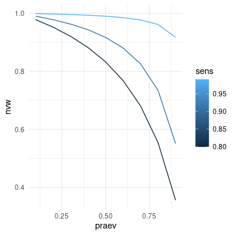

```{r setup, include=FALSE}
require(RAppArmor)     # auf Server notwendig für abgesicherte Codeausführung in Übungen
library(learnr)        # für Quizze, Code-Übungen, etc.
library(gradethis)     # für Evaluierung von Code-Einsendungen
library(shiny)         # für interaktive Elemente
library(data.tree)     # für Baumdiagramme
library(ggplot2)       # für Grafiken

knitr::opts_chunk$set(echo = FALSE)

# Quizaufgaben sind momentan noch nicht richtig internationalisiert bei learnr;
# Wir überschreiben die englischsprachigen Nachrichten:
correct_msg <- "Richtig!"
incorrect_msg <- "Leider falsch. Versuch's noch ein mal."

# Das gleiche gilt für gradethis:
options("gradethis.pass" = correct_msg)
options("gradethis.fail" = incorrect_msg)   # damit werden Codevorschläge bei falscher Antwort deaktiviert
gradethis_setup()

# Werte für das Beispiel
prevalence <- 0.2 / 100.0   # P(K)
sens <- 0.97    # P(T|K)
spec <- 0.997   # P(¬T|¬K)
pos_pred_val <- sens * prevalence / (sens * prevalence + (1-spec) * (1-prevalence))   # P(K|T)
```

## Fragestellung

Eine Person fühlt sich gerade krank und macht einen Corona Schnelltest. Leider fällt der Test positiv aus.

{height=300px}


Der Test ist zwar positiv, aber wie sicher kann sich die Person sein, dass sie wirklich an Corona erkrankt ist, d.h. wie sicher kann sie sich sein, dass das Testergebnis korrekt ist? Die gleiche Frage könnte man sich auch stellen, wenn der Test negativ wäre: Wie sicher ist es in diesem Fall, dass die Person wirklich *nicht* an Corona infiziert ist?

Zunächst einmal können wir feststellen, dass wir es mit vier Möglichkeiten zu tun haben:

- Die Person ist krank und der Test ist positiv
- Die Person ist krank und der Test ist negativ
- Die Person ist gesund und der Test ist positiv
- Die Person ist gesund und der Test ist negativ

Man kann das übersichtlich als Tabelle darstellen:

<div class="with_sidebar">

<div class="main">

|  | Test positiv | Test negativ |
|-----:|:----:|:----:|
|  **Person krank**    |   richtig positiv   |  falsch negativ    |
|  **Person gesund**    |   falsch positiv   |  richtig negativ   |

</div>

<div class="side">
Diese Tabellendarstellung wird *Wahrheitsmatrix* oder auch *Konfusionsmatrix* genannt.
</div>

</div>


```{r confmat}
question("Nehmen wir an, ein fiktiver Test könnte drei verschiedene Antworten liefern: nicht erkrankt, mild erkrankt und schwer erkrankt. Wie sähe die Konfusionsmatrix für solch einen Test aus?",
  answer("So wie oben, d.h. 2 Zeilen und 2 Spalten."),
  answer("2 Zeilen und 3 Spalten."),
  answer("3 Zeilen und 2 Spalten."),
  answer("3 Zeilen und 3 Spalten.", correct = TRUE),
  answer("Es ist nicht möglich, eine Konfusionsmatrix für Tests mit mehr als zwei möglichen Antworten zu erstellen."),
  allow_retry = TRUE,
  correct = correct_msg,
  incorrect = incorrect_msg
)
```


## Analyse

Wir wollen uns nun anschauen, wie wir herausfinden können, wie stark wir einem positiven Ergebnis eines (Corona-)Tests trauen können. D.h. **wie hoch ist die Wahrscheinlichkeit, dass eine Person tatsächlich krank ist, wenn der Test positiv ausfällt?**

Zunächst können wir diese Fragestellung als Baumdiagramm darstellen, was uns später bei der Berechnung helfen wird:


```{r fig.height=3, fig.align='center'}
# Knoten und Kanten des Baumdiagramms
root <- Node$new('')
node_k <- root$AddChild("Person krank")
node_k_p <- node_k$AddChild("Test positiv")
node_k_np <- node_k$AddChild("Test negativ")
node_nk <- root$AddChild("Person gesund")
node_nk_p <- node_nk$AddChild("Test positiv")
node_nk_np <- node_nk$AddChild("Test negativ")

# Optische Anpassungen
SetNodeStyle(root, shape = 'point')
SetNodeStyle(node_k, shape = 'ellipse')
SetNodeStyle(node_nk, shape = 'ellipse')
SetGraphStyle(root, rankdir = "LR")   # Baum von links nach rechts statt von oben nach unten

# Resultat darstellen
plot(root)
```

Damit wir später gut rechnen können, definieren wir zunächst zwei Ereignisse und deren Negation. Diese entsprechen den oben genannten Möglichkeiten:

- $K$:Person krank
- $\neg K$: Person gesund
- $T$: Test positiv
- $\neg T$: Test negativ

Diese Ereignisse können wir in ein Baumdiagramm übertragen, zusammen mit den dazugehörigen Wahrscheinlichkeiten $P$:

```{r fig.height=3, fig.align='center'}
# Knoten und Kanten des Baumdiagramms
root <- Node$new('')
SetEdgeStyle(root, fontsize = 10)

# oberer Strang (krank)
node_k <- root$AddChild("K")
SetEdgeStyle(node_k, label = "P(K)")
node_k_p <- node_k$AddChild("T")
SetEdgeStyle(node_k_p, label = "P(T|K)")
node_k_np <- node_k$AddChild("¬T")
SetEdgeStyle(node_k_np, label = "P(¬T|K)")

# unterer Strang (nicht krank)
node_nk <- root$AddChild("¬K")
SetEdgeStyle(node_nk, label = "P(¬K)")
node_nk_p <- node_nk$AddChild("T")
SetEdgeStyle(node_nk_p, label = "P(T|¬K)")
node_nk_np <- node_nk$AddChild("¬T")
SetEdgeStyle(node_nk_np, label = "P(¬T|¬K)")

# Optische Anpassungen
SetNodeStyle(root, shape = 'point')
SetNodeStyle(node_k, shape = 'ellipse')
SetNodeStyle(node_nk, shape = 'ellipse')
SetGraphStyle(root, rankdir = "LR")

# Resultat darstellen
plot(root)
```

Wie in der Frage eingangs formuliert, möchten wir wissen, wie hoch die Wahrscheinlichkeit ist, dass eine Person tatsächlich krank ist, wenn der Test positiv ausfällt. Das lässt sich mithilfe der oben definierten Ereignisse als *bedingte Wahrscheinlichkeit* formulieren – die Wahrscheinlichkeit, dass eine Person krank ist, gegeben dass der Test positiv ist: $P(K \mid T)$. Diese Wahrscheinlichkeit wird auch *positiver Vorhersagewert* genannt. Wie errechnen wir diese Wahrscheinlichkeit? Der **Satz von Bayes** gibt uns die Möglichkeit dazu:


$$
P(K \mid T) = \frac{P(T \mid K) P(K)}{P(T)}.
$$

Was wir also brauchen, um $P(K \mid T)$ zu berechnen, sind drei Wahrscheinlichkeiten: $P(K)$, $P(T \mid K)$ und $P(T)$.

<div class="with_sidebar">

<div class="main">
$P(K)$ gibt an, wir hoch generell die Wahrscheinlichkeit ist, zu diesem Zeitpunkt an Corona erkrankt zu sein – ganz unabhängig von einem Testergebnis. Genau können wir diese Wahrscheinlichkeit niemals wissen, aber wir können ein Schätzwert nehmen, der dem Anteil der aktuell an Corona infizierten Menschen in Deutschland entspricht. Setzen wir zunächst $P(K) = `r prevalence * 100`\%$. Das ist in etwa die Prävalenz bei der ersten Coronawelle im Frühjahr 2020 in Deutschland.
</div>

<div class="side">
Die Kennzahl, die aussagt wie hoch der Prozentsatz der Menschen ist, die zu einem bestimmten Zeitpunkt an einer bestimmten Krankheit leidet, wird *Prävalenz* genannt.
</div>

</div>

Nun brauchen wir $P(T \mid K)$.

```{r P_T_K}
question("Was gibt die Wahrscheinlichkeit $P(T \\mid K)$ an?",
  answer("Die Wahrscheinlichkeit dass ein Test positiv ist, wenn die geteste Person krank ist.", correct = TRUE),
  answer("Die Wahrscheinlichkeit dass eine Person gesund ist, wenn sie einen positiven Test hatte."),
  answer("Die Wahrscheinlichkeit dass eine Person krank ist, wenn sie einen positiven Test hatte."),
  answer("Die Wahrscheinlichkeit dass ein Test positiv ist, obwohl die geteste Person gesund ist."),
  allow_retry = TRUE,
  correct = correct_msg,
  incorrect = incorrect_msg
)
```

$P(T \mid K)$ wird *Sensitivität* genannt und ist ein Gütemaß für einen Test. Die Sensitivität gibt an, wie hoch die Wahrscheinlichkeit ist, dass der Test ein positives Ergebnis anzeigt für eine tatsächlich erkrankte Person und wird daher auch *Richtig-positiv-Rate* genannt. In den Beipackzetteln von Schnelltests findet sich üblicherweise auch eine Angabe zu dessen Sensitivität.

**TODO:** Bild Beipackzettel.

Schließlich fehlt noch $P(T)$: die Wahrscheinlichkeit dafür, dass eine Person – egal ob krank oder gesund – bei einem Test ein positives Ergebnis erhält. Hier hilft uns das *Gesetz der totalen Wahrscheinlichkeit*, das es uns erlaubt die Wahrscheinlichkeiten für die beiden Möglichkeiten, die zu positiven Tests führen (Person krank und Person gesund), zu addieren, da sie sich gegenseitig ausschließen:

```{r fig.height=3, fig.align='center'}
# Knoten und Kanten des Baumdiagramms
root <- Node$new('')
SetEdgeStyle(root, fontsize = 10)

# oberer Strang (krank)
node_k <- root$AddChild("K")
SetEdgeStyle(node_k, label = "P(K)", color = "red")
node_k_p <- node_k$AddChild("T")
SetNodeStyle(node_k_p, color = "red")
SetEdgeStyle(node_k_p, label = "P(T|K)", color = "red")
node_k_np <- node_k$AddChild("¬T")
SetEdgeStyle(node_k_np, label = "P(¬T|K)", color = "black")

# unterer Strang (nicht krank)
node_nk <- root$AddChild("¬K")
SetEdgeStyle(node_nk, label = "P(¬K)", color = "red")
node_nk_p <- node_nk$AddChild("T")
SetNodeStyle(node_nk_p, color = "red")
SetEdgeStyle(node_nk_p, label = "P(T|¬K)", color = "red")
node_nk_np <- node_nk$AddChild("¬T")
SetEdgeStyle(node_nk_np, label = "P(¬T|¬K)", color = "black")

# Optische Anpassungen
SetNodeStyle(root, shape = 'point')
SetNodeStyle(node_k, shape = 'ellipse')
SetNodeStyle(node_nk, shape = 'ellipse')
SetGraphStyle(root, rankdir = "LR")

# Resultat darstellen
plot(root)
```

Somit erhalten wir

$$
P(T) = P(T \mid K) P(K) + P(T \mid \neg K) P(\neg K),
$$

und damit

$$
P(K \mid T) = \frac{P(T \mid K) P(K)}{P(T)} = \frac{P(T \mid K) P(K)}{P(T \mid K) P(K) + P(T \mid \neg K) P(\neg K)}.
$$

Das bringt uns allerdings zwei neue Probleme ein: Wir brauchen $P(T \mid \neg K)$ und $P(\neg K)$. Beides können wir zum Glück über die Wahrscheinlichkeit für komplementäre Ereignisse berechnen. Damit ist $P(\neg K)$ (die generelle Wahrscheinlichkeit *nicht* krank zu sein) leicht zu errechnen, denn $P(K)$ (die generelle Wahrscheinlichkeit krank zu sein, geschätzt mittels Prävalenz) kennen wir schon: $P(\neg K) = 100\% - P(K) = `r (1 - prevalence)*100`\%$.

Fehlt zu guter letzt noch $P(T \mid \neg K)$: Die Wahrscheinlichkeit ein positives Testergebnis zu haben, wenn man eigentlich gesund ist (ein *falsch-positives Ergebnis*). Hier hilft uns ein weiteres Gütemaß für Tests weiter: die *Spezifität*, auch *Richtig-negativ Rate* genannt. Sie gibt uns die Wahrscheinlichkeit an, dass eine Person ein negatives Testergebnis erhält, wenn sie tatsächlich gesund ist, also $P(\neg T | \neg K)$. Auch die Spezifität wird oft im Beipackzettel von Schnelltests abgedruckt. Wie wir im Baumdiagramm sehen, ist $P(\neg T | \neg K)$ komplementär zu $P(T | \neg K)$ und damit gilt $P(T | \neg K) = 100\% - P(\neg T | \neg K)$.

### Berechnung

Um beispielhaft zu berechnen, wie hoch die Wahrscheinlichkeit ist, dass eine Person tatsächlich krank ist, wenn sie ein positives Testergebnis erhält, nehmen wir zunächst gängige Werte für die Sensitivität und Spezifität von guten COVID Schnelltests an:

- Sensitivität: $P(T \mid K) = `r sens * 100`\%$
- Spezifität: $P(\neg T \mid \neg K) = `r spec * 100`\%$

Für die Prävalenz hatten wir $P(K) = `r prevalence * 100`\%$ angenommen.

Damit können wir die Werte in die Formel einsetzen und erhalten:

\begin{align}
P(K \mid T) &= \frac{P(T \mid K) P(K)}{P(T \mid K) P(K) + P(T \mid \neg K) P(\neg K)} \\
            &= \frac{P(T \mid K) P(K)}{P(T \mid K) P(K) + (1 - P(\neg T \mid \neg K)) (1 - P(K))} \\
            &= \frac{`r sens` \cdot `r prevalence`}{`r sens` \cdot `r prevalence` + (1 - `r spec`) \cdot (1 - `r prevalence`)} \\
            &= `r round(pos_pred_val, 4)`.
\end{align}

### Interpretation

Die Wahrscheinlichkeit, dass eine Person mit positivem Schnelltest tatsächlich krank ist (positiver Vorhersagewert), beträgt also nur rund $`r round(pos_pred_val * 100)`\%$. Das ist tatsächlich keine sonderlich hohe Wahrscheinlichkeit. Auf der folgenden Seite werden wir uns genauer anschauen, warum das so ist.

---

#### Aufgabe 1

Berechnen Sie die Wahrscheinlichkeit, dass eine Person, die einen negativen Schnelltest hat, tatsächlich gesund ist. Benutzen Sie dabei die selben Parameter (Prävalenz, Sensitivität, Spezifität) wie in der obigen Beispielberechnung. Sie können dafür die Variablen `prevalence`, `sens` und `spec` im Code verwenden.

```{r neg_pred_value, exercise=TRUE, exercise.timelimit=5}

```

```{r neg_pred_value-solution}
spec * (1-prevalence) / (spec * (1-prevalence) + (1-sens) * prevalence)
```

```{r neg_pred_value-check}
grade_this({
    # P(nicht K|nicht T) berechnen
    neg_pred_val <- spec * (1-prevalence) / (spec * (1-prevalence) + (1-sens) * prevalence)
    # Prüfen d. Ergebnisses
    if (identical(round(.result, 6), round(neg_pred_val, 6))) {
        pass()
    }
    fail()  # falls nicht korrekt
})
```


<div id="neg_pred_value-hint">
Versuchen Sie, den Satz von Bayes für die bedingte Wahrscheinlichkeit $P(\neg K \mid \neg T)$ anzuwenden.
</div>


## Der Einfluss von Prävalenz und Testgenauigkeit

Schauen wir uns noch mal die Berechnung der bedingten Wahrscheinlichkeit $P(K \mid T)$ an:

\begin{align}
P(K \mid T) &= \frac{P(T \mid K) P(K)}{P(T \mid K) P(K) + P(T \mid \neg K) P(\neg K)} \\
            &= \frac{`r sens` \cdot `r prevalence`}{`r sens` \cdot `r prevalence` + `r 1-spec` \cdot `r 1-prevalence`} \\
            &= `r round(pos_pred_val, 4)`.
\end{align}

Man sieht daran sehr gut, welch großen Einfluss die Prävalenz auf das Gesamtergebnis hat: Selbst bei hoher Sensitivität des Tests wird der Zähler $P(T \mid K) P(K)$ und damit das Gesamtergebnis sehr klein, wenn die Prävalenz sehr klein ist. Das macht auch intuitiv Sinn: Wenn es insgesamt sehr wenige Fälle einer Krankheit gibt, ist die Wahrscheinlichkeit vergleichsweise gering, dass eine Person ausgerechnet damit erkrankt ist, selbst wenn der Test positiv ausfällt. Dagegen ist die Wahrscheinlichkeit sehr hoch, dass eine Person an einer Krankheit erkrankt ist, bei der es gerade viele Krankheitsfälle gibt (die Prävalenz also sehr hoch ist) ganz unabhängig davon, wie gut der Test funktioniert.

Wir können das auch visualisieren, indem wir $P(K \mid T)$ in Abhängigkeit der Prävalenz darstellen für fest gewählte Sensitivität und Spezifität:

```{r}
calc_ppv <- function(prev, sens, spec) {
    sens * prev / (sens * prev + (1-spec) * (1-prev))
}

# Erstellung eines Dataframes mit der Kombination aller Parameter (kartesisches Produkt)
ppv_by_param <- expand.grid(prev = seq(0, 1, length.out = 1001),
                            sens = c(0.9, 0.97, 0.9999),
                            spec = seq(0.990, 0.999, length.out = 10))
# P(K|T) für jede Parameterkombination berechnen
ppv_by_param$ppv <- calc_ppv(ppv_by_param$prev, ppv_by_param$sens, ppv_by_param$spec)

# Darstellung P(K|T) für bestimmte Sensitivität und Spezifität in Abh. von Prävalenz
fixed_sens <- sens
fixed_spec <- spec

ppv_fixed_sens_spec <- ppv_by_param[ppv_by_param$sens == fixed_sens & ppv_by_param$spec == fixed_spec, ]

ggplot(ppv_fixed_sens_spec, aes(prev, ppv)) +
    geom_line() +
    # X-Achse in Prozent
    scale_x_continuous('Prävalenz', labels = scales::percent) +
    # Y-Achse in Prozent
    scale_y_continuous(expression("P" * (K ~ "|" ~ T )), labels = scales::percent) +
    labs(title = expression("Positiver Vorhersagewert P" * (K ~ "|" ~ T ) ~ "in Abhängigkeit der Prävalenz"),
         subtitle = sprintf("Bei Sensitivität von %.1f%% und Spezifität von %.1f%%.", fixed_sens * 100, fixed_spec * 100)) +
    theme_minimal()
```

Wir sehen, wie stark die Kurve ansteigt und schon bei einer Prävalenz von 10% können wir einem Testergebnis mit der gegebenen Sensitivität und Spezifität trauen. Für geringere Prävalenzen ist das weniger gerechtfertigt, wie hier noch mal im Detail dargestellt:


```{r, warning=FALSE}
# wie oben, nur mit Begrenzung der X-Achse
ggplot(ppv_fixed_sens_spec, aes(prev, ppv)) +
    geom_line() +
    scale_x_continuous('Prävalenz', labels = scales::percent, limits = c(0.001, 0.02)) +
    scale_y_continuous(expression("P" * (K ~ "|" ~ T )), labels = scales::percent) +
    labs(title = expression("Positiver Vorhersagewert P" * (K ~ "|" ~ T ) ~ "in Abhängigkeit der Prävalenz"),
         subtitle = sprintf("Bei Sensitivität von %.1f%% und Spezifität von %.1f%%.", fixed_sens * 100, fixed_spec * 100)) +
    theme_minimal()
```


Andererseits zeigt es auch, wie wichtig genaue Tests sind. Bei niedriger Prävalenz spielt hierbei besonders die Spezifität eine wichtige Rolle, wie folgende Grafiken zeigen:


```{r, warning=FALSE}
# Wie oben, aber mit verschiedenen Werten für die Spezifität als unterschiedlich gefärbte Linien und
# mit versch. Werten für die Sensitivität als extra Grafik (facets)
ppv_by_param$spec_lbl <- sprintf("%.1f%%", ppv_by_param$spec * 100)
ggplot(ppv_by_param, aes(prev, ppv, color = spec_lbl, group = spec_lbl)) +
    geom_line() +
    scale_x_continuous('Prävalenz', labels = scales::percent, limits = c(0.001, 0.02)) +
    scale_y_continuous(expression("P" * (K ~ "|" ~ T )), labels = scales::percent) +
    # Spezifität als diskrete Werte auffassen anstatt kontinuierliche Werte
    scale_color_discrete("Spezifität") +
    labs(title = expression("Positiver Vorhersagewert P" * (K ~ "|" ~ T )),
         subtitle = "In Abhängigkeit der Prävalenz, Sensitivität und Spezifität.") +
    # für jeden Wert der Sensitivität eine extra Grafik
    facet_wrap(vars(sens), labeller = as_labeller(function(s) {sprintf("%.2f%%", as.numeric(s)*100)})) +
    theme_minimal()
```

Mittels dieser interaktiven Grafik können Sie für selbst gewählte Sensitivitäts- und Spezifitätswerte den positiven Vorhersagewert in Abhängigkeit zur Prävalenz darstellen:

```{r}
# Eingaberegler für Sensitivität, Spez., und maximal dargestellte Prävalenz
sliderInput("slider_sens", "Sensitivität in Prozent", min = 0, max = 100, value = 95, step = 0.1)
sliderInput("slider_spec", "Spezifität in Prozent", min = 0, max = 100, value = 95, step = 0.1)
sliderInput("slider_prev_max", "Maximal dargestellte Prävalenz in Prozent (x-Achse)", min = 0, max = 100, value = 2, step = 0.1)
# Plotausgabe
plotOutput("ppv_interactive")
```

```{r, context="server"}
# Erzeugung der Plotausgabe im Shiny "Serverkontext"
output$ppv_interactive <- renderPlot({
  sens <- input$slider_sens / 100
  spec <- input$slider_spec / 100
  # Daten generieren für Prävalenz
  df <- data.frame(prev = seq(0, input$slider_prev_max / 100, length.out = 1000))
  # P(K|T) berechnen
  df$ppv <- sens * df$prev / (sens * df$prev + (1-spec) * (1-df$prev))
  
  # Plot erstellen
  ggplot(df, aes(prev, ppv)) +
    geom_line() +
    scale_x_continuous('Prävalenz', labels = scales::percent) +
    scale_y_continuous(expression("P" * (K ~ "|" ~ T )), labels = scales::percent, limits = c(0, 1)) +
    labs(title = expression("Positiver Vorhersagewert P" * (K ~ "|" ~ T ) ~ "in Abhängigkeit der Prävalenz"),
         subtitle = sprintf("Bei Sensitivität von %.1f%% und Spezifität von %.1f%%.", input$slider_sens, input$slider_spec)) +
    theme_minimal()
})
```


```{r ppv_sens}
question("Warum spielt die Sensitivität bei niedriger Prävalenz keine so starke Rolle für den positiven Vorhersagewert?",
  answer("Da bei niedriger Prävalenz unabhängig vom Testergebnis die Wahrscheinlichkeit sehr gering ist, erkrankt zu sein.", correct = TRUE),
  answer("Da bei niedriger Prävalenz die Sensitivität automatisch geringer ist."),
  answer("Da bei niedriger Prävalenz der Term $P(T \\mid K) P(K)$ immer sehr klein ausfällt, die Sensitivität $P(T \\mid K)$ also kaum einen Einfluss auf das Gesamtergebnis haben kann.", correct = TRUE),
  allow_retry = TRUE,
  correct = correct_msg,
  incorrect = incorrect_msg
)
```

Die Spezifität $P(\neg T \mid \neg K)$ hat einen großen Einfluss, denn wie wir schon gezeigt haben gilt

\begin{align}
P(K \mid T) &= \frac{P(T \mid K) P(K)}{P(T \mid K) P(K) + P(T \mid \neg K) P(\neg K)} \\
            &= \frac{P(T \mid K) P(K)}{P(T \mid K) P(K) + (1 - P(\neg T \mid \neg K)) P(\neg K)}, \\ 
\end{align}

und da $P(K)$ sehr klein ist, ist $P(\neg K)$ sehr groß und somit hat die Spezifität $P(\neg T \mid \neg K)$ über den Term $(1 - P(\neg T \mid \neg K)) P(\neg K)$ die "Macht" über den Nenner. Damit bewirkt eine hohe Spezifität einen kleinen Nenner und damit einen hohen positiven Vorhersagewert.

Wir sehen also: gute Tests (insbesondere mit hoher Spezifität) können hier gerade am Anfang einer Krankheitswelle einen großen Unterschied machen, denn sie erlauben es schon frühzeitig recht zuverlässig Infektionen zu erkennen, selbst wenn die Prävalenz noch niedrig ist.

Auch andere Parameter und Umstände abseits der Prävalenz und der Testgüte haben noch bedeutenden Einfluss auf das Ergebnis. Insbesondere ist es wichtig, wie gründlich der Abstrich vorgenommen wurde. Es ist auch bekannt, dass die Temperatur die Genauigkeit von COVID-Schnelltests beeinflusst. Sie sehen also, dass die Berechnungen noch deutlich komplexer werden können!

---

#### Aufgabe 2a

Analog zu den Grafiken für den positiven Vorhersagewert $P(K \mid T)$ möchten wir eine Grafik für den negativen Vorhersagewert $P(\neg K \mid \neg T)$ erstellen. Diese Grafik soll den negativen Vorhersagewert in Abhängigkeit von der Prävalenz und der Sensitivität darstellen.

Zunächst brauchen wir dazu einen *Dataframe* mit einer Reihe von Prävalenz- und Sensitivitätswerten. Erzeugen Sie einen solchen Dataframe für alle Kombinationen aus den Prävalenzwerten $0.1, 0.2, \dots, 0.9$ und den Sensitivitätswerten $0.9, 0.97$ und $0.99$. Sie können dafür die Funktion `expand.grid` verwenden. Der Dataframe sollte `nvw_param` heißen und die Spalten `praev` und `sens` haben.

```{r nvw_a, exercise=TRUE, exercise.timelimit=5, exercise.blanks = "___+"}
nvw_param <- expand.grid(praev = ___,
                         sens = ___)
nvw_param
```

```{r nvw_a-solution}
nvw_param <- expand.grid(praev = seq(0.1, 0.9, length.out = 9),
                         sens = c(0.9, 0.97, 0.99))
nvw_param
```

```{r nvw_a-check}
grade_this({
    nvw_param <- expand.grid(praev = seq(0.1, 0.9, length.out = 9),
                             sens = c(0.9, 0.97, 0.99))
    
    # Gleitkommazahlenprüfung mit näherungsweiser Übereinstimmung
    if (isTRUE(all.equal(.result, nvw_param))) {
        pass()
    }
    fail()
})
```

#### Aufgabe 2b

Berechnen Sie als nächstes den negativen Vorhersagewert $P(\neg K \mid \neg T)$ für alle gegebenen Parameter und fügen Sie das Ergebnis als Spalte `nvw` zum Dataframe `nvw_param` hinzu. Nutzen Sie dafür eine festgelegte Spezifität von $99.7\%$.

```{r nvw_b-setup}
nvw_param <- expand.grid(praev = seq(0.1, 0.9, length.out = 9),
                         sens = c(0.9, 0.97, 0.99))
nvw_param
```

```{r nvw_b, exercise=TRUE, exercise.timelimit=5, exercise.blanks = "___+", exercise.setup="nvw_b-setup"}
spez <- 0.997
nvw_param$nvw <- ___
nvw_param
```

```{r nvw_b-solution}
spez <- 0.997
nvw_param$nvw <- spez * (1-nvw_param$praev) / (spez * (1-nvw_param$praev) + (1-nvw_param$sens) * nvw_param$praev)
nvw_param
```

```{r nvw_b-check}
grade_this({
    nvw_param <- expand.grid(praev = seq(0.1, 0.9, length.out = 9),
                             sens = c(0.9, 0.97, 0.99))
    spez <- 0.997
    nvw_param$nvw <- spez * (1-nvw_param$praev) / (spez * (1-nvw_param$praev) + (1-nvw_param$sens) * nvw_param$praev)
    
    # Gleitkommazahlenprüfung mit näherungsweiser Übereinstimmung
    if (isTRUE(all.equal(.result, nvw_param))) {
        pass()
    }
    fail()
})
```

#### Aufgabe 2c

Erstellen Sie eine Grafik mit *ggplot2*, welche den negativen Vorhersagewert in Abhängigkeit der Prävalenz darstellt. Dabei sollen für die drei unterschiedlichen Werte der Sensitivität drei farblich unterschiedliche Linien dargestellt werden.

Die erzeugte Grafik sollte wie folgt aussehen:

{width=400px}


```{r nvw_c-setup, exercise.setup="nvw_b-setup"}
spez <- 0.997
nvw_param$nvw <- spez * (1-nvw_param$praev) / (spez * (1-nvw_param$praev) + (1-nvw_param$sens) * nvw_param$praev)
```

```{r nvw_c, exercise=TRUE, exercise.timelimit=5, exercise.blanks = "___+", exercise.setup="nvw_c-setup"}
ggplot(nvw_param, aes(___)) +
    ___ +  # "geom_..." für Linienplot
    theme_minimal()
```

```{r nvw_c-solution}
ggplot(nvw_param, aes(praev, nvw, color = sens, group = sens)) +
    geom_line() +
    theme_minimal()
```

```{r nvw_c-code-check}
grade_this_code()
```


## Wie zuverlässig sind mehrere Tests?

TODO
